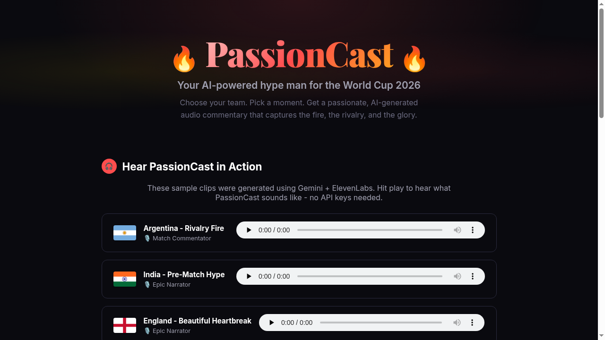
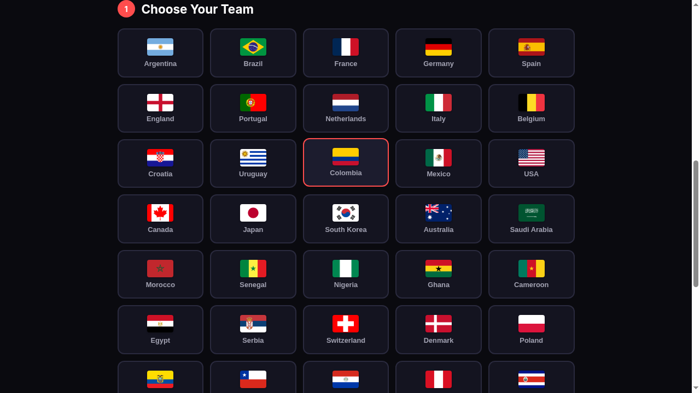
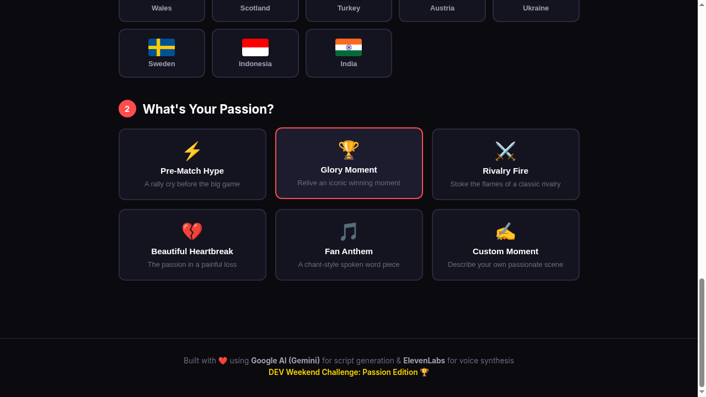
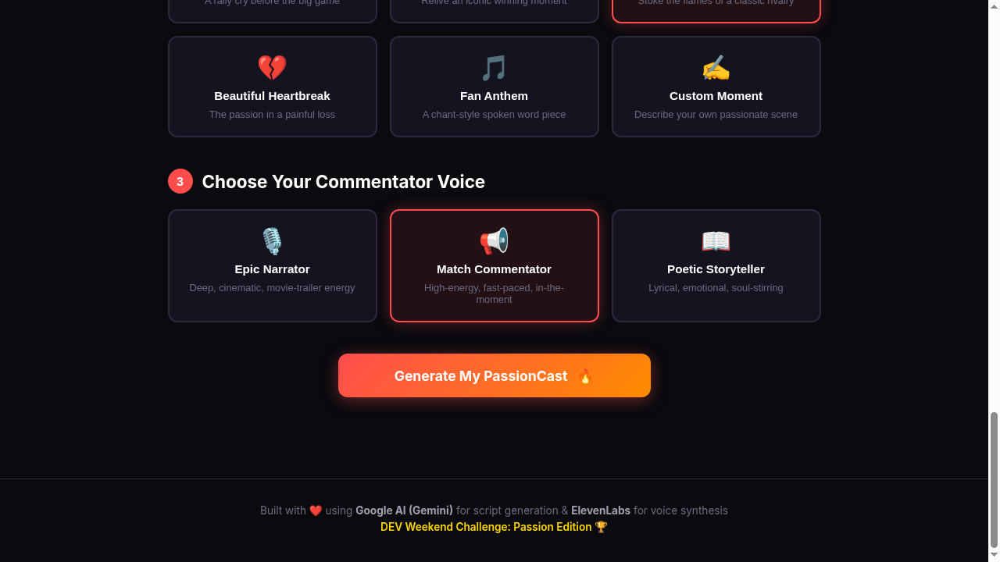

# 🔥 PassionCast

**Your personal AI hype man for the World Cup 2026.**

Pick your team. Choose a moment. Get a passionate, AI-generated audio commentary that captures the fire of football fandom.

👉 **[Try PassionCast Live](https://simplynadaf.github.io/PassionCast/)**



---

## How It Works

1. **Pick your team** from 48 World Cup 2026 nations
2. **Choose your passion** — hype speech, glory moment, rivalry fire, heartbreak, or fan anthem
3. **Select a voice** — epic narrator, match commentator, or poetic storyteller
4. **Generate** — Gemini writes the script, ElevenLabs brings it to life as audio


---

## Tech Stack

| Layer | Technology | Why |
|-------|-----------|-----|
| Script generation | Google AI (Gemini 2.0 Flash) | High temperature (0.9) + cultural context = scripts that feel personal, not generic |
| Voice synthesis | ElevenLabs (Multilingual v2) | Low stability (0.4) for emotional range, high style (0.6) for expressiveness |
| Frontend | Vanilla JS + Vite | Fast, no framework overhead, deploys anywhere |
| Hosting | GitHub Pages | Free, automatic deploys via GitHub Actions |

No backend. No database. Client-side only. API calls go directly from the browser to official APIs.

---

## Quick Start

```bash
git clone https://github.com/simplynadaf/PassionCast.git
cd PassionCast
npm install
npm run dev
```

Open `http://localhost:3000` and enter your API keys:
- [Get a free Google AI key](https://aistudio.google.com/apikey)
- [Get a free ElevenLabs key](https://elevenlabs.io/app/settings/api-keys)

Keys are stored in localStorage. Never sent anywhere except the official APIs.

---

## Architecture

```
Browser → Gemini API (script generation) → ElevenLabs API (voice synthesis) → Audio playback
```

**Design decisions:**
- Temperature 0.9 on Gemini produces passionate, varied scripts. Lower values were too safe.
- ElevenLabs stability at 0.4 gives emotional variation. Default (0.5+) sounded robotic for commentary.
- Three voice characters (Brian, Liam, Charlotte) matched to content types (dramatic, energetic, poetic).
- Flag images from flagcdn.com instead of emoji. Renders correctly on every OS and browser.

---

## Screenshots

| Sample Clips | Team Grid | Passion Modes | Ready to Generate |
|---|---|---|---|
|  |  |  |  |

---

## DEV Weekend Challenge

Built for the [DEV Weekend Challenge: Passion Edition](https://dev.to/challenges/weekend-2026-07-09) (July 2026).

**Prize categories:**
- ✅ Best Use of Google AI
- ✅ Best Use of ElevenLabs

---

## License

MIT

---

<div align="center">

### Built by

<a href="https://github.com/simplynadaf">
  
</a>
<a href="https://dev.to/sarvar_04">
  
</a>
<a href="https://sarvarnadaf.com">
  
</a>

**Sarvar Nadaf** — Cloud Architect at Big 4

☁️ 10+ years in IT & Cloud | 🏅 AWS x7 · Azure x2 · GCP x1 | 🌱 AWS Community Builder (4 yrs) | ✍️ 200+ articles · 15K+ followers

---

⭐ If you found this interesting, give it a star!

</div>
